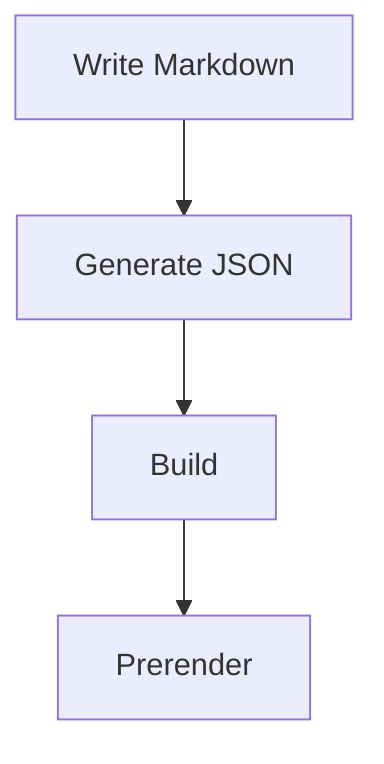
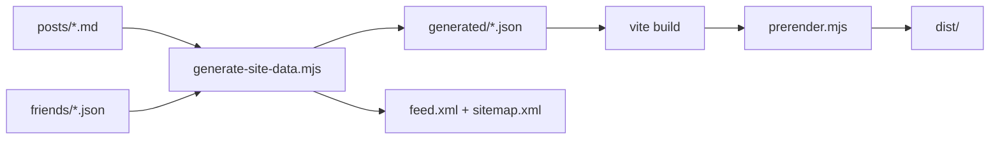

# D-blog

<div align="center">


基于 React 19 + Vite 6 + TypeScript 构建的现代化静态博客系统，采用 Markdown 内容驱动架构，集成全文搜索、RSS 订阅、SEO 优化、预渲染、PWA 离线访问及 Cloudflare Analytics 数据统计等企业级特性。

**在线演示**：<https://blog.pldduck.com>

</div>

## 项目概览

D-blog 是一个功能完整的生产级博客系统，已在实际环境中稳定运行。系统提供完善的内容管理、用户交互和数据分析能力，包含以下核心页面：

- **首页** (`/`)：文章列表展示、精选内容推荐、分类筛选、分页导航、全局搜索、多维度排序
- **文章详情** (`/post/:id`)：智能目录导航、阅读进度追踪、代码高亮与复制、Mermaid 图表渲染、数学公式支持、图片预览、社交分享
- **归档页** (`/archive`)：按时间轴组织的文章归档，支持年份分组浏览
- **标签页** (`/tags`)：标签聚合视图、标签详情页、实时搜索过滤
- **统计页** (`/stats`)：Cloudflare Analytics 数据可视化展示
- **友链页** (`/friends`)：友情链接管理、在线申请表单、JSON 配置模板
- **关于页** (`/about`)：站点介绍与个人信息
- **404 页面**：友好的错误提示与导航引导

## 功能特性

### 1. 内容管理系统

- **Markdown 驱动**：使用 `posts/*.md` 管理文章内容，支持标准 Front Matter 元数据
- **友链管理**：通过 `friends/*.json` 配置友情链接
- **丰富的元数据支持**：
  - 基础信息：`id`、`title`、`excerpt`、`date`、`updatedAt`
  - 分类标签：`category`、`tags`
  - 展示控制：`coverImage`、`featured`、`top`、`draft`
  - 作者信息：`author`、`authors`（支持单作者与多作者模式）
- **自动化构建流程**：
  - 自动生成文章元数据索引（`generated/posts.json`）
  - 自动生成全文搜索索引（`generated/posts-search.json`）
  - 自动生成友链数据（`generated/friends.json`）
  - 自动生成统计快照（`generated/cloudflare.json`）
  - 自动计算文章阅读时长（`readTime`）
  - 自动过滤草稿文章（`draft: true`）
  - 自动回退至默认作者配置

### 2. 阅读体验优化

- **首页功能**：
  - 多维度筛选：分类过滤、关键词搜索、排序切换
  - 智能排序：置顶文章（`top`）→ 精选文章（`featured`）→ 发布日期
  - 分页导航与精选内容卡片展示
- **全局搜索**：
  - 懒加载搜索索引，优化首屏性能
  - 多范围搜索：分类、正文内容、标题
  - 智能加权匹配与结果排序
- **文章阅读增强**：
  - 面包屑导航与智能目录树
  - 代码语法高亮与一键复制
  - 数学公式渲染（KaTeX）
  - Mermaid 流程图与图表支持
  - 阅读进度实时追踪
  - 图片懒加载、模糊占位与点击预览
  - 社交分享功能
- **标签系统**：支持 URL 参数直达标签详情（`?tag=xxx`）
- **归档功能**：按年份分组浏览，支持页内实时搜索
- **友链互动**：在线申请表单与 JSON 配置模板一键复制
- **主题切换**：深色模式支持，平滑过渡动画
- **加载体验**：首次访问全屏加载动画

### 3. SEO 与性能优化

- **自动化 SEO**：
  - 自动生成 RSS 订阅（`public/feed.xml`）
  - 自动生成站点地图（`public/sitemap.xml`）
  - 自动注入 Canonical URL、Open Graph、Twitter Card 元数据
  - 结构化数据（JSON-LD）支持
- **预渲染技术**：
  - 构建时预渲染所有文章页
  - 预渲染核心静态页面（归档、标签、统计、友链、关于）
  - 提升首屏加载速度与 SEO 效果
- **PWA 离线支持**：
  - 完整的 PWA 配置（`manifest.webmanifest`）
  - Service Worker 智能缓存策略（`sw.js`）
  - 离线降级页面（`offline.html`）
  - 缓存范围：首页、归档、标签、统计、友链、关于页及核心资源

### 4. 数据统计与部署

- **Cloudflare Analytics 集成**：
  - 构建时生成统计数据快照
  - 运行时实时统计接口（`functions/api/cloudflare-stats.ts`）
  - 自动降级机制：实时接口失败时回退至构建快照
  - 环境变量缺失时不阻塞构建流程
- **灵活部署**：
  - 纯静态输出，支持多平台部署
  - 兼容 Cloudflare Pages、Vercel、Netlify、Nginx 等
  - 支持 Cloudflare Pages Functions 动态接口

## 技术架构

| 技术领域 | 技术选型 | 版本 |
| --- | --- | --- |
| 前端框架 | React | 19 |
| 构建工具 | Vite | 6 |
| 开发语言 | TypeScript | - |
| 路由管理 | React Router DOM | 6 |
| 样式方案 | Tailwind CSS | - |
| 动画库 | Framer Motion | - |
| Markdown 渲染 | React Markdown | - |
| Markdown 扩展 | Remark GFM、Remark Math | - |
| HTML 增强 | Rehype Highlight、Rehype KaTeX | - |
| 图表渲染 | Mermaid | - |
| SEO 优化 | React Helmet Async | - |
| 元数据解析 | Gray Matter | - |

## 项目结构

```text
D-blog/
├── config/                      # 配置文件目录
│   ├── postcss.config.js       # PostCSS 配置
│   ├── site.config.ts          # 站点全局配置
│   ├── tailwind.config.js      # Tailwind CSS 配置
│   └── tsconfig.json           # TypeScript 配置
├── friends/                     # 友情链接数据（JSON 格式）
├── functions/                   # Cloudflare Pages Functions
│   └── api/
│       └── cloudflare-stats.ts # 实时统计数据接口
├── generated/                   # 构建生成的数据文件（自动生成）
│   ├── posts.json              # 文章元数据索引
│   ├── posts-search.json       # 全文搜索索引
│   ├── friends.json            # 友链数据
│   ├── cloudflare.json         # 统计数据快照
│   └── site-stats.json         # 站点统计信息
├── posts/                       # Markdown 文章内容
├── public/                      # 静态资源目录
│   ├── posts-img/              # 文章配图
│   ├── feed.xml                # RSS 订阅（自动生成）
│   ├── sitemap.xml             # 站点地图（自动生成）
│   ├── manifest.webmanifest    # PWA 配置
│   ├── sw.js                   # Service Worker
│   ├── offline.html            # 离线降级页面
│   └── ...                     # 其他静态资源
├── scripts/                     # 构建脚本
│   ├── generate-site-data.mjs  # 数据生成脚本
│   └── prerender.mjs           # 预渲染脚本
├── src/                         # 源代码目录
│   ├── components/             # React 组件
│   ├── hooks/                  # 自定义 Hooks
│   ├── pages/                  # 页面组件
│   ├── services/               # 数据服务层
│   ├── utils/                  # 工具函数
│   ├── App.tsx                 # 应用根组件
│   ├── index.css               # 全局样式
│   ├── index.tsx               # 应用入口
│   ├── registerServiceWorker.ts # Service Worker 注册
│   └── types.ts                # TypeScript 类型定义
├── .env.example                 # 环境变量示例
├── index.html                   # HTML 模板
├── package.json                 # 项目依赖配置
└── vite.config.ts              # Vite 构建配置
```

## 快速开始

### 系统要求

- **Node.js**：>= 20.0.0
- **npm**：>= 10.0.0

### 安装部署

#### 1. 克隆项目

```bash
git clone https://github.com/ououduck/D-blog.git
cd D-blog
```

#### 2. 安装依赖

```bash
npm install
```

#### 3. 配置环境变量（可选）

复制环境变量模板并根据需要配置：

```bash
cp .env.example .env
```

主要配置项：
- `CLOUDFLARE_API_TOKEN`：Cloudflare API 令牌（用于统计功能）
- `CLOUDFLARE_ZONE_ID`：Cloudflare Zone ID（用于统计功能）

> 注意：环境变量缺失不会影响项目构建，统计功能将自动降级。

#### 4. 本地开发

```bash
npm run dev
```

开发服务器将自动执行以下操作：
1. 生成文章元数据和搜索索引
2. 启动 Vite 开发服务器
3. 启用热模块替换（HMR）

默认访问地址：<http://localhost:3000>

#### 5. 生产构建

```bash
npm run build
```

构建流程包含以下步骤：

1. **数据解析**：读取 `posts/` 和 `friends/` 目录内容
2. **索引生成**：生成文章元数据、全文搜索索引、友链数据
3. **统计快照**：拉取或生成 Cloudflare Analytics 数据快照
4. **SEO 优化**：生成 RSS 订阅和站点地图
5. **静态构建**：执行 Vite 生产构建
6. **预渲染**：对文章页和核心页面进行预渲染
7. **错误页面**：生成 404 错误页面

构建产物输出至 `dist/` 目录。

#### 6. 预览构建结果

```bash
npm run preview
```

启动本地静态服务器预览生产构建结果。

## NPM 脚本说明

| 命令 | 功能描述 |
| --- | --- |
| `npm run gen:data` | 生成文章元数据、搜索索引、友链数据、统计快照、RSS 订阅和站点地图 |
| `npm run prerender` | 基于构建产物和生成数据执行预渲染操作 |
| `npm run dev` | 启动开发环境（自动执行数据生成） |
| `npm run build` | 执行完整的生产构建流程 |
| `npm run preview` | 本地预览生产构建结果 |

## 内容管理

### 新建文章

在 [`posts/`](./posts) 下新增 Markdown 文件，例如 `my-first-post.md`：

```yaml
---
id: my-first-post
title: 我的第一篇文章
excerpt: 这里填写文章摘要，会用于列表展示和 SEO 描述
date: 2026-03-14
updatedAt: 2026-03-20
category: 随笔
tags:
  - React
  - Vite
coverImage: /posts-img/example.png
featured: false
top: 1
draft: false
author:
  name: 跑路的duck
  role: 前端菜鸟
---

# 正文标题

这里开始写正文，支持标准 Markdown、GFM 表格、代码块等内容。
```

字段说明：

- `id`：文章唯一标识，对应路由 `/post/:id`
- `title`：文章标题
- `excerpt`：文章摘要
- `date`：发布日期，建议使用 `YYYY-MM-DD`
- `updatedAt`：最后更新时间，可选；存在时会显示在文章页并参与 SEO / RSS / Sitemap
- `category`：文章分类；当前会被归一化到以下值之一：`教程`、`技术`、`随笔`、`分享`、`其他`
- `tags`：标签数组
- `coverImage`：封面图路径
- `featured`：是否作为首页精选卡片展示
- `top`：置顶排序，数字越小优先级越高，可选
- `draft`：是否为草稿；`true` 时构建自动过滤
- `author`：单作者写法，支持字符串或对象
- `authors`：多作者写法，支持数组；如果未填写，会回退到 `site.config.ts` 中的默认作者
- `readTime`：无需填写，构建时会根据正文内容自动计算

多作者示例：

```yaml
authors:
  - name: 张三
    role: 编辑
  - name: 李四
    url: https://example.com
```

### Markdown 增强能力

文章页会按内容自动加载对应能力：

- 代码块：启用语法高亮和代码复制按钮
- 数学公式：启用 `remark-math` + `rehype-katex`
- Mermaid：渲染流程图、时序图等
- 图片：支持懒加载、模糊占位和点击放大预览

示例：

````md
```ts
console.log('hello D-blog');
```

$$
E = mc^2
$$


````

### 新建友情链接

在 [`friends/`](./friends) 下新增 JSON 文件：

```json
{
  "name": "示例站点",
  "description": "这里填写站点简介",
  "avatar": "https://example.com/avatar.png",
  "url": "https://example.com"
}
```

要求：

- 所有字段都必须是非空字符串
- 不符合格式的文件会在构建阶段被自动跳过
- 友链页内置了申请弹窗和 JSON 模板，适合直接引导别人提 PR

### 站点配置

主要配置位于 [`config/site.config.ts`](./config/site.config.ts)，可修改：

- 站点标题、副标题、描述、Logo、SEO 图片
- 默认作者信息
- 社交链接
- 目录收起行为
- 友情链接页说明和仓库地址
- 备案信息

## 数据处理与构建流程

### 数据生成机制

数据生成脚本 [`scripts/generate-site-data.mjs`](./scripts/generate-site-data.mjs) 负责以下核心任务：

**文章处理**：
- 解析 Markdown 文件的 Front Matter 元数据
- 提取正文纯文本并生成全文搜索索引
- 自动计算文章阅读时长（基于字数统计）
- 归一化作者信息（`author` / `authors`）
- 归一化文章分类（`category`）
- 过滤草稿状态文章（`draft: true`）

**数据输出**：
- `generated/posts.json`：文章元数据索引
- `generated/posts-search.json`：全文搜索索引
- `generated/friends.json`：友链数据
- `generated/cloudflare.json`：统计数据快照
- `public/feed.xml`：RSS 订阅源
- `public/sitemap.xml`：搜索引擎站点地图

### 预渲染机制

预渲染脚本 [`scripts/prerender.mjs`](./scripts/prerender.mjs) 基于 `dist/index.html` 模板生成静态 HTML 文件：

**预渲染页面**：
- 所有文章详情页（`/post/:id`）
- 归档页（`/archive`）
- 标签页（`/tags`）
- 统计页（`/stats`）
- 关于页（`/about`）
- 友链页（`/friends`）
- 404 错误页（`404.html`）

**优势**：
- 提升首屏加载速度
- 改善 SEO 爬虫抓取效果
- 支持无 JavaScript 环境的基础访问

### 搜索实现原理

系统采用构建时索引生成策略，而非运行时文件遍历：

**索引文件**：
- `generated/posts.json`：包含文章基础元数据
- `generated/posts-search.json`：包含完整正文内容的搜索索引

**搜索流程**：
1. 用户触发搜索时懒加载搜索索引
2. 根据搜索范围（标题/分类/正文）进行匹配
3. 按加权评分和发布日期排序结果
4. 返回匹配的文章列表

### 构建流程图



## Cloudflare Analytics 配置

### 环境变量配置

统计功能需要配置以下环境变量：

```bash
CLOUDFLARE_API_TOKEN=your_api_token_here
CLOUDFLARE_ZONE_ID=your_zone_id_here
```

### 获取配置信息

1. **API Token**：
   - 登录 Cloudflare Dashboard
   - 进入 "My Profile" → "API Tokens"
   - 创建新 Token，授予 "Analytics:Read" 权限

2. **Zone ID**：
   - 进入目标站点的 Dashboard
   - 在右侧边栏 "API" 部分查看 Zone ID

### 工作机制

**构建阶段**：
- `generate-site-data.mjs` 脚本拉取最近 1/7/30 天的统计数据
- 生成静态快照文件 `generated/cloudflare.json`
- 环境变量缺失时生成空快照（`enabled: false`），不阻塞构建

**运行阶段**：
- Cloudflare Pages Functions 提供实时统计接口（`/api/cloudflare-stats`）
- 前端优先请求实时接口
- 接口失败时自动降级至构建快照

### 权限要求

建议为 API Token 配置以下权限：
- Zone → Analytics → Read
- 限制 Token 仅访问目标 Zone

### 降级策略

系统具备完善的降级机制：
1. 优先使用实时统计接口
2. 接口失败时回退至构建快照
3. 快照不可用时显示空状态
4. 环境变量缺失不影响其他功能

## 部署指南

### 支持的部署平台

本项目输出纯静态文件，支持部署至以下平台：

- **Cloudflare Pages**（推荐）：支持 Pages Functions 实时统计
- **Vercel**：自动 HTTPS、全球 CDN
- **Netlify**：持续部署、表单处理
- **Nginx**：自托管服务器
- **其他静态托管服务**：GitHub Pages、GitLab Pages 等

### Cloudflare Pages 部署

#### 1. 连接 Git 仓库

- 登录 Cloudflare Dashboard
- 进入 "Pages" → "Create a project"
- 连接 GitHub/GitLab 仓库

#### 2. 配置构建设置

```yaml
Build command: npm run build
Build output directory: dist
Root directory: /
Node version: 20
```

#### 3. 配置环境变量

在 "Settings" → "Environment variables" 中添加：
- `CLOUDFLARE_API_TOKEN`
- `CLOUDFLARE_ZONE_ID`

#### 4. 部署

提交代码后自动触发构建和部署。

### SPA 路由配置

项目使用 `BrowserRouter`，需要配置 SPA 回退规则：

**Cloudflare Pages**：
自动处理，无需额外配置。

**Vercel**：
创建 `vercel.json`：

```json
{
  "rewrites": [
    { "source": "/(.*)", "destination": "/index.html" }
  ]
}
```

**Netlify**：
创建 `netlify.toml`：

```toml
[[redirects]]
  from = "/*"
  to = "/index.html"
  status = 200
```

**Nginx**：
配置 `nginx.conf`：

```nginx
location / {
  try_files $uri $uri/ /index.html;
}
```

### 性能优化建议

1. **启用 CDN**：利用平台提供的全球 CDN 加速
2. **配置缓存**：为静态资源设置合理的缓存策略
3. **启用压缩**：Gzip/Brotli 压缩减小传输体积
4. **HTTPS**：确保全站 HTTPS 访问
5. **HTTP/2**：启用 HTTP/2 提升并发性能

### 持续集成

推荐配置 Git Hooks 或 CI/CD 流程：

```bash
# 提交前检查
npm run build

# 确保构建成功后再推送
git push
```

## 贡献指南

欢迎提交 Issue 和 Pull Request 来改进本项目。

### 提交 Issue

- 使用清晰的标题描述问题
- 提供复现步骤和环境信息
- 附上相关截图或错误日志

### 提交 Pull Request

1. Fork 本仓库
2. 创建特性分支（`git checkout -b feature/amazing-feature`）
3. 提交更改（`git commit -m 'Add amazing feature'`）
4. 推送到分支（`git push origin feature/amazing-feature`）
5. 创建 Pull Request

### 代码规范

- 遵循项目现有的代码风格
- 确保代码通过 TypeScript 类型检查
- 提交前执行 `npm run build` 确保构建成功

## 许可证

本项目采用 [MIT](./LICENSE) 许可证。

## 致谢

感谢所有为本项目做出贡献的开发者。

---

<div align="center">

**如果这个项目对你有帮助，欢迎 Star ⭐**

</div>
