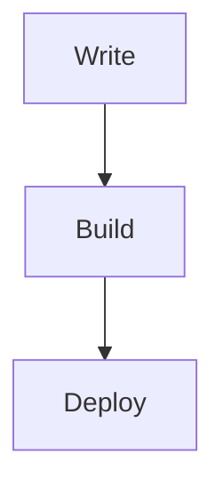

# D-blog

<div align="center">


基于 React 19 + Vite 6 + TypeScript 构建的现代化静态博客系统

**在线演示**：<https://blog.pldduck.com>

</div>

## 核心特性

- **Markdown 驱动** - 使用 Markdown 文件管理内容，支持 Front Matter 元数据
- **全文搜索** - 构建时生成搜索索引，支持标题、分类、正文多维度搜索
- **阅读体验** - 代码高亮、数学公式、Mermaid 图表、图片预览、目录导航
- **PWA 支持** - Service Worker 缓存策略，支持离线访问
- **性能优化** - 预渲染、代码分割、懒加载、图片优化
- **SEO 友好** - 自动生成 RSS、Sitemap、结构化数据
- **数据统计** - 集成 Cloudflare Analytics
- **深色模式** - 支持主题切换

## 快速开始

### 系统要求

- Node.js >= 20.0.0
- npm >= 10.0.0

### 安装部署

```bash
# 克隆项目
git clone https://github.com/ououduck/D-blog.git
cd D-blog

# 安装依赖
npm install

# 配置环境变量（可选）
cp .env.example .env

# 本地开发
npm run dev

# 生产构建
npm run build

# 预览构建结果
npm run preview
```

默认访问地址：<http://localhost:3000>

## 项目结构

```text
D-blog/
├── config/                      # 配置文件
│   ├── site.config.ts          # 站点全局配置
│   ├── tailwind.config.js      # Tailwind CSS 配置
│   └── tsconfig.json           # TypeScript 配置
├── posts/                       # Markdown 文章内容
├── friends/                     # 友情链接数据（JSON）
├── public/                      # 静态资源
│   ├── posts-img/              # 文章配图
│   ├── feed.xml                # RSS 订阅（自动生成）
│   ├── sitemap.xml             # 站点地图（自动生成）
│   └── sw.js                   # Service Worker
├── scripts/                     # 构建脚本
│   ├── generate-site-data.mjs  # 数据生成脚本
│   └── prerender.mjs           # 预渲染脚本
├── src/                         # 源代码
│   ├── components/             # React 组件
│   ├── pages/                  # 页面组件
│   ├── services/               # 数据服务层
│   └── utils/                  # 工具函数
└── functions/                   # Cloudflare Pages Functions
    └── api/
        └── cloudflare-stats.ts # 实时统计接口
```

## 内容管理

### 新建文章

在 `posts/` 目录下创建 Markdown 文件：

```yaml
---
id: my-first-post
title: 我的第一篇文章
excerpt: 文章摘要，用于列表展示和 SEO
date: 2026-03-14
category: 技术
tags:
  - React
  - Vite
coverImage: /posts-img/example.png
featured: false
top: 1
draft: false
---

# 正文标题

这里开始写正文，支持标准 Markdown、GFM 表格、代码块等。
```

**字段说明**：

- `id`：文章唯一标识，对应路由 `/post/:id`
- `title`：文章标题
- `excerpt`：文章摘要
- `date`：发布日期（YYYY-MM-DD）
- `category`：文章分类（教程/技术/随笔/分享/其他）
- `tags`：标签数组
- `coverImage`：封面图路径
- `featured`：是否作为首页精选展示
- `top`：置顶排序（数字越小优先级越高）
- `draft`：是否为草稿（true 时构建自动过滤）

### Markdown 增强

支持以下增强功能：

````md
# 代码高亮
```ts
console.log('hello D-blog');
```

# 数学公式
$$
E = mc^2
$$

# Mermaid 图表

````

### 新建友链

在 `friends/` 目录下创建 JSON 文件：

```json
{
  "name": "示例站点",
  "description": "站点简介",
  "avatar": "https://example.com/avatar.png",
  "url": "https://example.com"
}
```

### 站点配置

修改 `config/site.config.ts` 配置站点信息：

- 站点标题、副标题、描述
- 默认作者信息
- 社交链接
- 备案信息

## 技术栈

| 技术领域 | 技术选型 |
| --- | --- |
| 前端框架 | React 19 |
| 构建工具 | Vite 6 |
| 开发语言 | TypeScript |
| 路由管理 | React Router DOM 6 |
| 样式方案 | Tailwind CSS |
| 动画库 | Framer Motion |
| Markdown 渲染 | React Markdown + Remark + Rehype |
| 图表渲染 | Mermaid |
| SEO 优化 | React Helmet Async |

## Cloudflare Analytics 配置

### 环境变量

在 `.env` 文件中配置：

```bash
CLOUDFLARE_API_TOKEN=your_api_token_here
CLOUDFLARE_ZONE_ID=your_zone_id_here
```

### 获取配置

1. **API Token**：Cloudflare Dashboard → My Profile → API Tokens → 创建 Token（Analytics:Read 权限）
2. **Zone ID**：站点 Dashboard → 右侧边栏 API 部分

### 工作机制

- **构建阶段**：生成统计数据快照 `generated/cloudflare.json`
- **运行阶段**：优先使用实时接口，失败时降级至构建快照
- **降级策略**：环境变量缺失不影响构建，统计功能自动降级

## 部署指南

### Cloudflare Pages（推荐）

```yaml
Build command: npm run build
Build output directory: dist
Node version: 20
```

在 Settings → Environment variables 中添加：
- `CLOUDFLARE_API_TOKEN`
- `CLOUDFLARE_ZONE_ID`

### 其他平台

**Vercel**：创建 `vercel.json`

```json
{
  "rewrites": [
    { "source": "/(.*)", "destination": "/index.html" }
  ]
}
```

**Netlify**：创建 `netlify.toml`

```toml
[[redirects]]
  from = "/*"
  to = "/index.html"
  status = 200
```

**Nginx**：配置 SPA 回退

```nginx
location / {
  try_files $uri $uri/ /index.html;
}
```

## NPM 脚本

| 命令 | 功能 |
| --- | --- |
| `npm run dev` | 启动开发服务器 |
| `npm run build` | 生产构建 |
| `npm run preview` | 预览构建结果 |
| `npm run gen:data` | 生成数据索引 |
| `npm run prerender` | 执行预渲染 |

## 贡献指南

欢迎提交 Issue 和 Pull Request！

1. Fork 本仓库
2. 创建特性分支
3. 提交更改
4. 推送到分支
5. 创建 Pull Request

## 许可证

本项目采用 [MIT](./LICENSE) 许可证。

---

<div align="center">

**如果这个项目对你有帮助，欢迎 Star**

</div>
